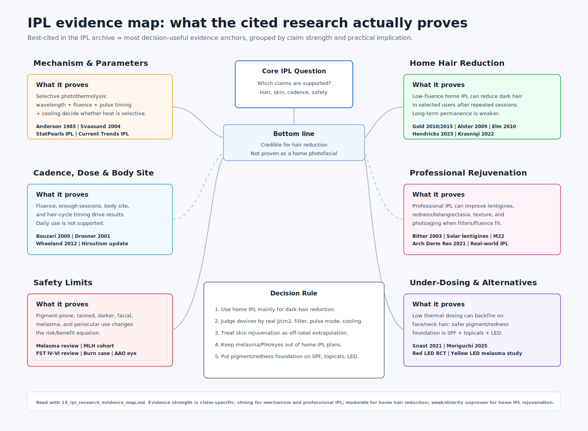

# IPL Research Evidence Map - Best-Cited Papers and What Each Proves

**Scope:** this pulls the highest-value papers and evidence sources already cited across the IPL folder, then groups them by what they actually support.

**Important ranking note:** "best-cited" here means **best-cited inside this research archive and most decision-useful**, not a live Google Scholar citation-count ranking. Citation counts change, and the practical question here is narrower: which cited papers are carrying the strongest claims about IPL physics, hair removal, cadence, rejuvenation, and safety?

---

## The short version

1. **IPL physics is solid.** Selective photothermolysis is the foundation: wavelength, fluence, pulse duration, target size, and cooling determine whether heat stays selective or spills into surrounding skin. [[1]](https://pubmed.ncbi.nlm.nih.gov/6836297/)[[2]](https://pubmed.ncbi.nlm.nih.gov/15065902/)[[3]](https://www.ncbi.nlm.nih.gov/books/NBK580525/)[[4]](https://pmc.ncbi.nlm.nih.gov/articles/PMC3390232/)
2. **Home IPL hair reduction is real, but not magic.** Small home-use studies show meaningful short-term hair reduction with low-fluence IPL in appropriate users, while longer-term evidence is weaker and maintenance is expected. [[5]](https://jcadonline.com/low-energy-intense-pulsed-light-for-hair-removal-at-home/)[[6]](https://pmc.ncbi.nlm.nih.gov/articles/PMC4509583/)[[7]](https://pubmed.ncbi.nlm.nih.gov/19292837/)[[8]](https://pubmed.ncbi.nlm.nih.gov/20432276/)[[9]](https://pmc.ncbi.nlm.nih.gov/articles/PMC10218747/)[[10]](https://aura.abdn.ac.uk/server/api/core/bitstreams/fc97152d-1aa6-4a5e-8c9d-b4ea642bf156/content)
3. **Dose, sessions, and body site matter more than treating every day.** The archive's cadence guidance is supported by hair-cycle physiology, session-count data, interval evidence, dose-response evidence, and body-site outcome differences - but there is still no perfect weekly-vs-biweekly home-IPL RCT. [[10]](https://aura.abdn.ac.uk/server/api/core/bitstreams/fc97152d-1aa6-4a5e-8c9d-b4ea642bf156/content)[[11]](https://pubmed.ncbi.nlm.nih.gov/15663662/)[[12]](https://doi.org/10.1078/1615-1615-00034)[[13]](https://pubmed.ncbi.nlm.nih.gov/22886431/)[[14]](https://pmc.ncbi.nlm.nih.gov/articles/PMC7190465/)[[15]](https://pubmed.ncbi.nlm.nih.gov/31579971/)
4. **Professional IPL rejuvenation is real.** Pigment, vascular redness/telangiectasia, and texture can improve when professional filters and fluences are used. This does **not** directly prove that a low-fluence home hair-removal IPL is a good rejuvenation device. [[4]](https://pmc.ncbi.nlm.nih.gov/articles/PMC3390232/)[[16]](https://pubmed.ncbi.nlm.nih.gov/12928821/)[[17]](https://pubmed.ncbi.nlm.nih.gov/22515674/)[[18]](https://link.springer.com/article/10.1007/s00403-021-02283-2)[[19]](https://pmc.ncbi.nlm.nih.gov/articles/PMC3806078/)[[20]](https://pmc.ncbi.nlm.nih.gov/articles/PMC12833585/)[[21]](https://dermnetnz.org/topics/intense-pulsed-light-therapy)
5. **Safety limits are the hinge.** Melasma-prone, PIH-prone, tanned, darker, or facial/periocular use changes the risk/benefit profile. The safety papers justify the archive's "hair use only; do not make this the primary pigment/redness tool" conclusion. [[22]](https://pmc.ncbi.nlm.nih.gov/articles/PMC5418955/)[[23]](https://pubmed.ncbi.nlm.nih.gov/25111558/)[[24]](https://pmc.ncbi.nlm.nih.gov/articles/PMC13012588/)[[25]](https://pmc.ncbi.nlm.nih.gov/articles/PMC12433457/)[[26]](https://www.aao.org/editors-choice/intense-pulsed-light-therapy-can-cause-ocular-comp)[[27]](https://pubmed.ncbi.nlm.nih.gov/34057666/)[[28]](https://pmc.ncbi.nlm.nih.gov/articles/PMC12040530/)

---

## Evidence categories

| IPL aspect | Best-cited evidence anchors | What they prove | What they do **not** prove | Decision implication |
|---|---|---|---|---|
| **1. Mechanism and parameters** | Anderson & Parrish 1983 [[1]](https://pubmed.ncbi.nlm.nih.gov/6836297/); Svaasand & Nelson 2004 [[2]](https://pubmed.ncbi.nlm.nih.gov/15065902/); StatPearls IPL [[3]](https://www.ncbi.nlm.nih.gov/books/NBK580525/); *Current Trends in IPL* [[4]](https://pmc.ncbi.nlm.nih.gov/articles/PMC3390232/) | Light can selectively injure chromophores if wavelength, fluence, pulse duration, delay, and cooling match the target. Cooling and pulse structure are not side details; they are part of the dose. | They do not prove that any specific home device clears pigment or hair at its advertised settings. | Judge devices by **J/cm2, cutoff filter, pulse mode, cooling, and real measured output**, not raw "J" marketing. |
| **2. Home IPL hair-removal efficacy** | Gold 2010 [[5]](https://jcadonline.com/low-energy-intense-pulsed-light-for-hair-removal-at-home/); Gold 2015 [[6]](https://pmc.ncbi.nlm.nih.gov/articles/PMC4509583/); Alster & Tanzi 2009 [[7]](https://pubmed.ncbi.nlm.nih.gov/19292837/); Elm 2010 [[8]](https://pubmed.ncbi.nlm.nih.gov/20432276/); Hendricks 2023 [[9]](https://pmc.ncbi.nlm.nih.gov/articles/PMC10218747/); Krasniqi 2022 systematic review [[10]](https://aura.abdn.ac.uk/server/api/core/bitstreams/fc97152d-1aa6-4a5e-8c9d-b4ea642bf156/content) | Low-fluence home IPL can reduce dark hair in selected Fitzpatrick I-IV users, especially after repeated sessions. The best short-term home IPL studies report large 1-3 month reductions; more conservative studies still show real effect. | They do not prove permanent removal, do not prove equal performance to clinic lasers, and do not test the exact Fansizhe T023A/Nood device. | Home IPL is credible for **dark body hair** and large-area convenience, but expectations should be suppression/maintenance, not one-and-done permanence. |
| **3. Fluence, session count, cadence, and body site** | Bouzari 2005 [[11]](https://pubmed.ncbi.nlm.nih.gov/15663662/); Drosner 2001 [[12]](https://doi.org/10.1078/1615-1615-00034); Wheeland 2012 [[13]](https://pubmed.ncbi.nlm.nih.gov/22886431/); Laser Treatment in Hirsutism update [[14]](https://pmc.ncbi.nlm.nih.gov/articles/PMC7190465/); body-site study [[15]](https://pubmed.ncbi.nlm.nih.gov/31579971/); Krasniqi 2022 [[10]](https://aura.abdn.ac.uk/server/api/core/bitstreams/fc97152d-1aa6-4a5e-8c9d-b4ea642bf156/content) | Hair-cycle timing matters; higher fluence and enough sessions improve durability; different body areas respond differently. Daily or every-few-days treatment is not supported by the biology. | The cadence evidence is cross-modality and imperfect: there is no ideal home-IPL trial randomizing weekly vs biweekly vs monthly. | Use **weekly or every-2-week ramp-up**, complete enough sessions, then maintain monthly/as-needed. Do not chase daily use. |
| **4. Professional IPL rejuvenation: pigment/redness/texture** | *Current Trends in IPL* [[4]](https://pmc.ncbi.nlm.nih.gov/articles/PMC3390232/); Bitter 2003 [[16]](https://pubmed.ncbi.nlm.nih.gov/12928821/); solar lentigines study [[17]](https://pubmed.ncbi.nlm.nih.gov/22515674/); Arch Dermatol Res systematic review [[18]](https://link.springer.com/article/10.1007/s00403-021-02283-2); M22 clinical applications [[19]](https://pmc.ncbi.nlm.nih.gov/articles/PMC3806078/); long-term real-world rejuvenation [[20]](https://pmc.ncbi.nlm.nih.gov/articles/PMC12833585/); DermNet IPL [[21]](https://dermnetnz.org/topics/intense-pulsed-light-therapy) | In professional settings, IPL can improve solar lentigines/dyschromia, telangiectasia/redness, texture, and photoaging when filters and fluences are appropriate. | Professional 12-40 J/cm2, swappable-filter IPL does not equal a 5-6.3 J/cm2 home hair-removal IPL. | For skin goals, the archive should separate **clinical IPL proof** from **home-device extrapolation**. Your device may offer a minor body-only sun-spot bonus, not reliable photofacial results. |
| **5. Melasma, PIH, darker skin, and facial risk** | Melasma management review [[22]](https://pmc.ncbi.nlm.nih.gov/articles/PMC5418955/); IPL-induced melasma-like hyperpigmentation [[23]](https://pubmed.ncbi.nlm.nih.gov/25111558/); Fitzpatrick IV-VI review [[24]](https://pmc.ncbi.nlm.nih.gov/articles/PMC13012588/); IPL burn case [[25]](https://pmc.ncbi.nlm.nih.gov/articles/PMC12433457/); AAO ocular warning [[26]](https://www.aao.org/editors-choice/intense-pulsed-light-therapy-can-cause-ocular-comp) | IPL can worsen or trigger pigment problems, especially in pigment-prone users; darker/tanned skin raises burn and hyper/hypopigmentation risk; periocular IPL can injure pigmented eye structures. | They do not mean IPL is unsafe for every person; risk depends on skin tone, lesion type, device settings, operator skill, eye protection, and sun exposure. | Do **not** use home IPL as primary treatment for melasma/PIH or near the eyes. Patch test, avoid tanning, use SPF, and keep facial use conservative or dermatologist-led. |
| **6. Paradoxical hypertrichosis / under-dosing risk** | Snast 2021 meta-analysis [[27]](https://pubmed.ncbi.nlm.nih.gov/34057666/); Moriguchi 2025 [[28]](https://pmc.ncbi.nlm.nih.gov/articles/PMC12040530/) | Paradoxical hair growth is uncommon overall but real, concentrated on face/neck and higher-risk profiles. Under-threshold heat can stimulate instead of disable follicles. | These papers do not identify a precise safe lower-bound fluence for every home device or body site. | Be cautious on male face/neck and fine vellus hair. Avoid repeated timid low-energy passes over areas that are not good candidates. |
| **7. Regulatory boundary** | Representative FDA OHT 510(k) [[29]](https://fda.innolitics.com/device/K230739); local FDA pipeline in this repo | Home IPL clearances in this project are hair-removal clearances. Rejuvenation claims are not the cleared home-device indication. | FDA clearance does not measure comparative efficacy, and absence of rejuvenation clearance does not prove zero biological effect. | Keep the claim language clean: **cleared for hair reduction**, not cleared for skin rejuvenation. |
| **8. What IPL does not need to carry alone** | Red LED RCT [[30]](https://pmc.ncbi.nlm.nih.gov/articles/PMC3926176/); yellow LED melasma/erythema study [[31]](https://pmc.ncbi.nlm.nih.gov/articles/PMC9776419/); topicals/photoprotection papers in doc 07 | Non-thermal LED, tinted sunscreen, and topicals support the safer primary plan for pigment/redness. | These are not IPL papers and do not prove IPL efficacy. | For the primary pigment/redness goal, IPL should be a secondary or professional tool, not the foundation. |

---

## Ranked anchor papers by claim

### Mechanism: "why IPL can work at all"

**Anderson & Parrish 1983** is the bedrock paper. It establishes selective photothermolysis: selective absorption plus controlled pulse timing can create localized thermal injury. [[1]](https://pubmed.ncbi.nlm.nih.gov/6836297/)

**Svaasand & Nelson 2004** is the archive's key paper for the hair-removal nuance: follicle damage is not governed only by the classic chromophore thermal relaxation time. Cooling efficiency and pulse structure strongly affect whether the epidermis is spared while follicular heat accumulates. [[2]](https://pubmed.ncbi.nlm.nih.gov/15065902/)

**StatPearls IPL** and **Current Trends in IPL** are practical clinical summaries that connect the physics to filters, fluence ranges, interpulse delays, and treatment series. [[3]](https://www.ncbi.nlm.nih.gov/books/NBK580525/)[[4]](https://pmc.ncbi.nlm.nih.gov/articles/PMC3390232/)

**What this proves:** IPL is not a vague light therapy; it is controlled thermal targeting.

**What this does not prove:** that a low-fluence consumer IPL with a fixed hair-removal filter will clear pigment, vessels, or wrinkles.

### Hair removal: "does home IPL actually reduce hair?"

**Gold 2010** and **Gold 2015** are the most favorable home-IPL evidence in the archive: low-fluence home pulsed-light devices used in repeated biweekly sessions produced large short-term hair-count reductions in small cohorts. [[5]](https://jcadonline.com/low-energy-intense-pulsed-light-for-hair-removal-at-home/)[[6]](https://pmc.ncbi.nlm.nih.gov/articles/PMC4509583/)

**Alster & Tanzi 2009** and **Elm 2010** are useful reality checks because their results are more modest and/or more home-like. They still support efficacy, but they temper the more dramatic 70-80% short-term numbers. [[7]](https://pubmed.ncbi.nlm.nih.gov/19292837/)[[8]](https://pubmed.ncbi.nlm.nih.gov/20432276/)

**Hendricks 2023** is especially useful because it compares home IPL with diode laser in a within-patient design. It supports the idea that home IPL works, while also showing the higher-fluence laser side can outperform it. [[9]](https://pmc.ncbi.nlm.nih.gov/articles/PMC10218747/)

**Krasniqi 2022** is the key systematic-review caveat: long-term RCT evidence is limited, not high quality, and IPL's long-term reduction is weaker/less durable than the cleaner short-term story. [[10]](https://aura.abdn.ac.uk/server/api/core/bitstreams/fc97152d-1aa6-4a5e-8c9d-b4ea642bf156/content)

**What this proves:** home IPL is credible for dark hair reduction in selected users.

**What this does not prove:** permanent clearance, exact performance of the T023A, or skin rejuvenation.

### Cadence/dose: "what treatment behavior actually matters?"

**Bouzari 2005** supports the archive's "do not drift too long" interval logic, but it is not home IPL and not a weekly-vs-biweekly RCT. [[11]](https://pubmed.ncbi.nlm.nih.gov/15663662/)

**Drosner 2001** and **Wheeland 2012** support the fluence principle: higher delivered J/cm2 improves durability in hair-reduction contexts. Drosner is an alexandrite laser dose-response paper; Wheeland is a home diode-laser paper, so both are principle-level comparators rather than direct IPL trials. [[12]](https://doi.org/10.1078/1615-1615-00034)[[13]](https://pubmed.ncbi.nlm.nih.gov/22886431/)

**Laser Treatment in Hirsutism: An Update** supports the biological ceiling: melanin-rich anagen follicles are the relevant target, so treating the same area too often cannot force resting follicles to become targetable. [[14]](https://pmc.ncbi.nlm.nih.gov/articles/PMC7190465/)

**The 948-patient body-site study** supports the practical ranking that underarms, bikini, and legs tend to outperform more difficult facial/hormonal/fine-hair areas. [[15]](https://pubmed.ncbi.nlm.nih.gov/31579971/)

**What this proves:** frequency is not the main lever; fluence, complete coverage, enough sessions, skin/hair suitability, and body site are.

**What this does not prove:** a perfect exact cadence for every home IPL user.

### Rejuvenation: "what does IPL prove for pigment, redness, texture?"

**Bitter 2003**, **Current Trends in IPL**, **M22 clinical applications**, **solar lentigines of the hands**, **long-term real-world rejuvenation**, and the **2021 systematic review** form the clinical rejuvenation cluster. [[4]](https://pmc.ncbi.nlm.nih.gov/articles/PMC3390232/)[[16]](https://pubmed.ncbi.nlm.nih.gov/12928821/)[[17]](https://pubmed.ncbi.nlm.nih.gov/22515674/)[[18]](https://link.springer.com/article/10.1007/s00403-021-02283-2)[[19]](https://pmc.ncbi.nlm.nih.gov/articles/PMC3806078/)[[20]](https://pmc.ncbi.nlm.nih.gov/articles/PMC12833585/)

Together they support a strong claim for professional IPL: pigment and vascular redness are the best-supported targets; texture/photoaging improves more variably; wrinkles/collagen tightening are weaker and slower.

**What this proves:** clinical IPL photorejuvenation is real.

**What this does not prove:** that a low-fluence home hair-removal IPL is a substitute for professional IPL/BBL.

### Safety: "where does the archive's caution come from?"

The **melasma management review** makes IPL a later-line, relapse-prone melasma option rather than a first-line home tool. [[22]](https://pmc.ncbi.nlm.nih.gov/articles/PMC5418955/)

The **IPL-induced melasma-like hyperpigmentation cohort** is the key warning for pigment-prone Fitzpatrick III-IV users. [[23]](https://pubmed.ncbi.nlm.nih.gov/25111558/)

The **Fitzpatrick IV-VI review**, **facial burn case**, and **AAO ocular warning** define the face/eye/darker-skin safety boundary. [[24]](https://pmc.ncbi.nlm.nih.gov/articles/PMC13012588/)[[25]](https://pmc.ncbi.nlm.nih.gov/articles/PMC12433457/)[[26]](https://www.aao.org/editors-choice/intense-pulsed-light-therapy-can-cause-ocular-comp)

**Snast 2021** and **Moriguchi 2025** explain why under-dosing on face/neck, especially in higher-risk groups, can backfire as paradoxical hypertrichosis. [[27]](https://pubmed.ncbi.nlm.nih.gov/34057666/)[[28]](https://pmc.ncbi.nlm.nih.gov/articles/PMC12040530/)

**What this proves:** the same melanin-targeting mechanism that makes IPL useful also creates the risk of pigment injury, burns, eye injury, and paradoxical stimulation.

**What this does not prove:** that IPL is categorically unsafe. It proves that indication, site, skin type, settings, and eye protection matter.

---

## Evidence gaps that still matter

1. **No direct clinical trial of this exact Fansizhe T023A/T023A-class device.** The measured output makes it credible, but clinical outcomes are inferred from nearby home IPL studies.
2. **No direct proof that a 510nm, ~6.3 J/cm2 home hair-removal IPL reliably rejuvenates skin.** The wavelength is directionally relevant; the fluence and indication are not the professional IPL evidence base.
3. **No ideal home-IPL cadence RCT.** Weekly vs biweekly guidance is built from physiology, manufacturer protocols, and adjacent clinical evidence.
4. **Long-term permanence remains weaker than marketing.** The systematic-review layer supports maintenance expectations.
5. **Pigment-prone facial use is the highest-risk unsolved zone.** The archive's safer primary route remains tinted SPF, topicals, and non-thermal LED, with professional care for pulsed-light escalation.

---

## Practical conclusion for this IPL project

The cited research supports using a home IPL device primarily for **hair reduction** on suitable dark hair and light-to-medium, untanned skin. It supports a conservative cadence: weekly or every two weeks during ramp-up, complete enough sessions, then maintain.

The same research does **not** support treating a home hair-removal IPL as a primary pigment/redness/photofacial device. Professional IPL rejuvenation is real, but it lives in a different settings class: higher fluence, swappable filters, cooling, trained operators, and eye protection.

So the archive's decision stays coherent:

- Buy/keep IPL for the hair goal.
- Treat skin rejuvenation claims as off-label extrapolation.
- For pigment/redness, lead with photoprotection/topicals/LED and reserve pulsed light for dermatologist-led or very cautious body-only use.

---

## Sources

1. Anderson RR, Parrish JA. *Selective photothermolysis: precise microsurgery by selective absorption of pulsed radiation.* Science. 1983. https://pubmed.ncbi.nlm.nih.gov/6836297/
2. Svaasand LO, Nelson JS. *On the physics of laser-induced selective photothermolysis of hair follicles.* J Biomed Opt. 2004. https://pubmed.ncbi.nlm.nih.gov/15065902/
3. StatPearls. *Intense Pulsed Light (IPL) Therapy.* https://www.ncbi.nlm.nih.gov/books/NBK580525/
4. Adatto MA, et al. *Current Trends in Intense Pulsed Light.* J Clin Aesthet Dermatol. https://pmc.ncbi.nlm.nih.gov/articles/PMC3390232/
5. Gold MH, Foster A, Biron JA. *Low-Energy Intense Pulsed Light for Hair Removal at Home.* J Clin Aesthet Dermatol. 2010. https://jcadonline.com/low-energy-intense-pulsed-light-for-hair-removal-at-home/
6. Gold MH, Biron JA, Thompson B. *Clinical Evaluation of a Novel Intense Pulsed Light Source for Facial Skin Hair Removal for Home Use.* J Clin Aesthet Dermatol. 2015. https://pmc.ncbi.nlm.nih.gov/articles/PMC4509583/
7. Alster TS, Tanzi EL. *Effect of a Novel Low-Energy Pulsed-Light Device for Home-Use Hair Removal.* Dermatol Surg. 2009. https://pubmed.ncbi.nlm.nih.gov/19292837/
8. Elm CML, Wallander ID, Walgrave SE, Zelickson BD. *Clinical study to determine the safety and efficacy of a low-energy, pulsed light device for home use hair removal.* Lasers Surg Med. 2010. https://pubmed.ncbi.nlm.nih.gov/20432276/
9. Hendricks AJ, et al. *Efficacy of a Home-Use Intense Pulsed Light Hair Removal Device vs Diode Laser.* https://pmc.ncbi.nlm.nih.gov/articles/PMC10218747/
10. Krasniqi F, et al. *Long-term efficacy of laser and light-based hair removal: systematic review.* 2022. https://aura.abdn.ac.uk/server/api/core/bitstreams/fc97152d-1aa6-4a5e-8c9d-b4ea642bf156/content
11. Bouzari N, et al. *Comparison of three different laser hair removal intervals.* https://pubmed.ncbi.nlm.nih.gov/15663662/
12. Drosner M, et al. 2001 alexandrite hair-removal dose-response record used in this archive. https://doi.org/10.1078/1615-1615-00034
13. Wheeland RG. *Permanent hair reduction with a home-use diode laser: safety and effectiveness 1 year after eight treatments.* Lasers Surg Med. 2012. https://pubmed.ncbi.nlm.nih.gov/22886431/
14. Bhat YJ, et al. *Laser Treatment in Hirsutism: An Update.* Dermatol Pract Concept. 2020. https://pmc.ncbi.nlm.nih.gov/articles/PMC7190465/
15. PubMed 31579971. Two-center body-site hair-removal outcome study. https://pubmed.ncbi.nlm.nih.gov/31579971/
16. Bitter PH Jr. *Noninvasive rejuvenation of photodamaged skin using serial, full-face intense pulsed light treatments.* Dermatol Surg. 2003. https://pubmed.ncbi.nlm.nih.gov/12928821/
17. PubMed 22515674. *Intense pulsed light for solar lentigines of the hands.* https://pubmed.ncbi.nlm.nih.gov/22515674/
18. Arch Dermatol Res 2021. *Intense pulsed light for skin rejuvenation: systematic review.* https://link.springer.com/article/10.1007/s00403-021-02283-2
19. *Lumenis M-22: aesthetic applications and clinical parameters.* https://pmc.ncbi.nlm.nih.gov/articles/PMC3806078/
20. *Long-term real-world IPL skin rejuvenation outcomes.* https://pmc.ncbi.nlm.nih.gov/articles/PMC12833585/
21. DermNet NZ. *Intense pulsed light therapy.* https://dermnetnz.org/topics/intense-pulsed-light-therapy
22. Sarkar R, et al. *Melasma management.* https://pmc.ncbi.nlm.nih.gov/articles/PMC5418955/
23. PubMed 25111558. *Intense pulsed light-induced melasma-like hyperpigmentation.* https://pubmed.ncbi.nlm.nih.gov/25111558/
24. *Noninvasive treatments for Fitzpatrick skin types IV-VI.* https://pmc.ncbi.nlm.nih.gov/articles/PMC13012588/
25. *Second-degree facial burn after IPL treatment: case report.* https://pmc.ncbi.nlm.nih.gov/articles/PMC12433457/
26. American Academy of Ophthalmology. *IPL therapy can cause ocular complications.* https://www.aao.org/editors-choice/intense-pulsed-light-therapy-can-cause-ocular-comp
27. Snast I, et al. *Paradoxical hypertrichosis after laser and light therapy: meta-analysis.* https://pubmed.ncbi.nlm.nih.gov/34057666/
28. Moriguchi P, et al. *Paradoxical hypertrichosis after laser epilation by sex/body site.* https://pmc.ncbi.nlm.nih.gov/articles/PMC12040530/
29. FDA 510(k) K230739, representative home IPL hair-removal clearance. https://fda.innolitics.com/device/K230739
30. Wunsch A, Matuschka K. *A controlled trial to determine the efficacy of red and near-infrared light treatment in patient satisfaction, reduction of fine lines, wrinkles, skin roughness, and intradermal collagen density increase.* https://pmc.ncbi.nlm.nih.gov/articles/PMC3926176/
31. *Effects of 590 nm yellow LED on melasma and erythema indices.* https://pmc.ncbi.nlm.nih.gov/articles/PMC9776419/
