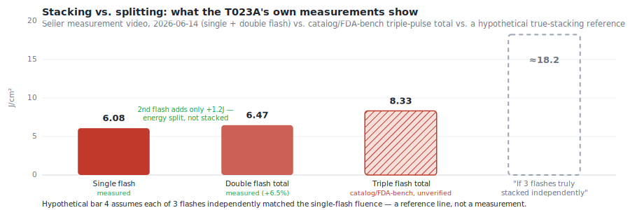
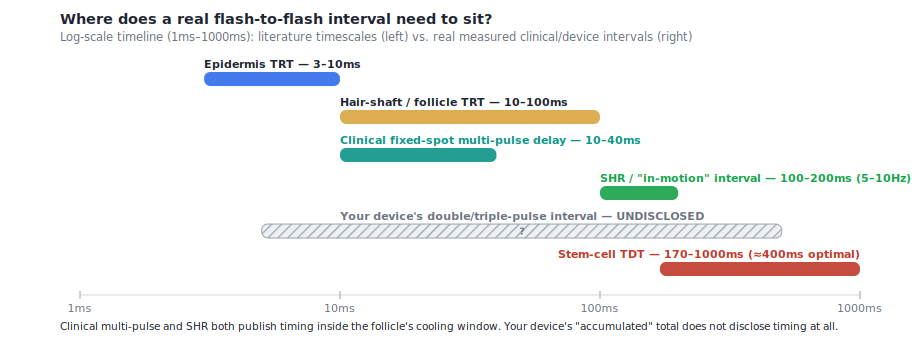
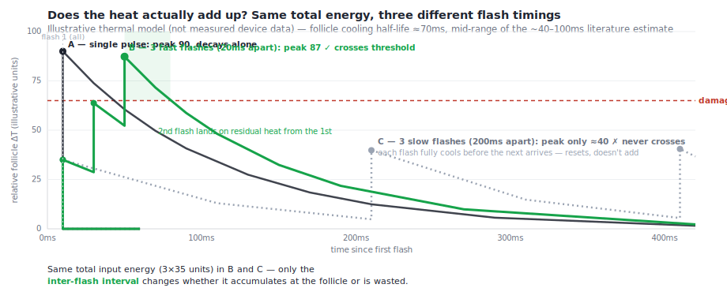

# Multi-Flash Thermal Accumulation — Does "8.33 J/cm² Over 3 Flashes" Really Add Up at the Follicle?

**The question:** Fansizhe's catalog lists some models (T055K, T033M, T033K) at up to **8.33–8.48 J/cm²** — but that figure is the *sum of three sub-pulses fired in under a second*, not one flash. You went with a **single/dual-pulse device** instead (the T023-family, ~19J in one flash ≈ **6.3 J/cm²**) specifically because you were worried that splitting energy across multiple weaker flashes might not heat the follicle enough before it cools between shots — losing effectiveness compared with one strong flash of similar or lower total energy. This doc runs that worry all the way down to the physics: how fast do flashes actually have to fire for their heat to *add up* at the follicle, what real research says about multi-flash accumulation for hair removal specifically, and — now that the evidence is in — whether going with the highest verified single-flash device was the right call.

> ⚠️ Not medical advice — this synthesizes peer-reviewed laser/IPL-physics literature plus this repo's own device research (catalog transcriptions, FDA filings, and a seller-supplied measurement video). See [02_ideal_device_specs.md](02_ideal_device_specs.md) and [06_final_recommendation.md](06_final_recommendation.md) for how the device decision was made, and [fansizhe_natalie_conversation_notes.md](fansizhe_natalie_conversation_notes.md) for the underlying seller-video evidence this doc leans on heavily. This is a *different* timescale question than [12_treatment_cadence_guide.md](12_treatment_cadence_guide.md) — that doc is about weeks between **sessions**; this one is about milliseconds between **flashes**.

> 🔥 **Make this interactive:** the [**SHR & Multi-Flash Thermal Simulator**](shr_thermal_simulator.html) lets you set flash energy, count, timing, skin tone and hair type and watch the epidermis, follicle, and deep stem-cell target heat up live — and whether they cross the damage threshold. Its prose companion, [16_shr_ulike_thermal_simulation.md](16_shr_ulike_thermal_simulation.md), applies all of this to **Ulike's "SHR mode"** specifically.

---

## ⭐ The honest bottom line (read this first)

**Yes — the evidence supports your decision, but not quite for the reason you may have assumed.** Rapid-fire flashes *can* genuinely add up at a hair follicle — that's real, validated physics, not marketing (Section 3–4). But "can" isn't "does": it only works if the gap between flashes is shorter than the follicle's own cooling time (roughly tens of milliseconds), and nobody discloses that gap for these budget devices. Worse, the one piece of hard evidence available — a seller-supplied measurement video of your device's own family — shows the "double flash" mode adds only **~1.2J** over a single flash (18.23J → 19.42J total). That's not what a genuine second full-strength flash landing on top of the first would look like. It's what a roughly fixed energy budget being sliced thinner looks like — see [the seller's measurement-video notes](fansizhe_natalie_conversation_notes.md).

Meanwhile, the one multi-pulse technique that *is* clinically validated for hair removal specifically (SHR / "in-motion") works nothing like a 2–3-shot "accumulate mode" — it's dozens of low-fluence pulses fired while continuously sliding the applicator (Section 4b). The catalog's "8.33 J/cm² accumulated / 3 flashes" claim isn't that technique wearing a different name; it's a third, unverified thing. Given a verified single-flash number (6.08 J/cm²) sitting on a well-supported part of the home-IPL dose-response curve versus an unverified "accumulated" headline with undisclosed timing, betting on the verified number was the lower-risk, better-supported choice.

---

## 1. Why this question exists — the catalog math behind "8.33 J/cm²"

This repo's own device research already surfaced the core tension. Two different Fansizhe device families report very similar-looking "8.33" numbers that mean *different things*:

| Device | Mode | Energy | Fluence | Status |
|---|---|---|---|---|
| T023A | Single flash | 18.23 J | **6.08 J/cm²** | Measured on seller video, 2026-06-14 |
| T023A | Double flash (total) | 19.42 J | **6.47 J/cm²** | Measured on seller video, 2026-06-14 — 2nd flash added only ~1.2J |
| T023A | "Triple flash" catalog headline | 25 J | 8.33 J/cm² | Catalog figure — **not independently measured in either mode shown** |
| T055K | Triple-pulse total | 25 J | 8.33 J/cm² | FDA K253881 bench-tested *as a total*, not as a single-flash claim |
| T033M | Triple-pulse total | 28 J | **8.48 J/cm²** | FDA K253881 bench-tested — highest verified *total* in the dataset |

*(Full spec derivation: [02_ideal_device_specs.md](02_ideal_device_specs.md) and [04_fansizhe_catalog_transcription.md](04_fansizhe_catalog_transcription.md).)*

There's also a coincidental unit collision worth flagging so it doesn't confuse anyone re-reading this later: "8.33" shows up **both** as an *accumulated total fluence* (25J ÷ 3cm² = 8.33 J/cm²) **and**, elsewhere in this repo's math, as a *per-sub-pulse energy* (25J ÷ 3 pulses = 8.33J/pulse, which is itself only ≈2.78 J/cm² per individual sub-pulse). Same number, two different meanings, purely because the spot size (≈3cm²) and the pulse count (3) happen to both be close to 3. When you see "8.33" anywhere in this research, check which one is meant.

The chart makes the shape of the problem visible: going from single → double flash is nearly flat (+6.5%), but the catalog's triple-flash headline jumps further (+37% over single) while still landing nowhere near what three *independently* full-strength flashes would add up to (≈18.2 J/cm², the dashed reference bar). Sections 2–5 work out whether that gap is expected (real stacking is never simply additive) or a red flag (the mode is dividing, not stacking).

---

## 2. The physics: two different clocks decide whether heat "sticks"

The foundational rule of laser/IPL dermatology is **selective photothermolysis**: deliver energy faster than a target's own cooling time (its **Thermal Relaxation Time**, TRT) and the heat stays local; deliver it slower and heat spreads into surrounding tissue. [[1]](https://pubmed.ncbi.nlm.nih.gov/6836297/) TRT scales with the *square* of the target's size, which is why it varies so much by structure:

- **Basal epidermal layer (~20µm):** 1.6–2.8ms [[2]](https://pmc.ncbi.nlm.nih.gov/articles/PMC5108992/)
- **Full epidermis / epidermal melanin layer (~50–100µm):** ~3–10ms — and clinically, IPL protocols space sequential pulses **10–12ms apart specifically to let the epidermis clear this TRT** before the next pulse, stretched to **20–40ms for darker skin** [[3]](https://www.ncbi.nlm.nih.gov/books/NBK580525/)
- **Hair shaft / follicle (~100–300µm, size-dependent):** ~10–100ms, with terminal (coarse, dark) follicles trending toward the top of that range [[4]](https://pmc.ncbi.nlm.nih.gov/articles/PMC9541334/)[[5]](https://pmc.ncbi.nlm.nih.gov/articles/PMC9239120/)[[6]](https://pmc.ncbi.nlm.nih.gov/articles/PMC7190465/)

That third number is why home-IPL hair removal works at all with millisecond pulses. But it *undersells* what permanent hair reduction actually requires, because the structure you need to kill for **permanent** reduction — the bulge stem-cell niche, a few hundred µm to ~1.5mm deep — isn't the pigmented part. Melanin (the "heater" that absorbs the light) lives in the hair shaft and bulb; the stem cells are unpigmented and physically separated from it. Heat has to *diffuse* there, and that diffusion is a slower, separate clock. Altshuler et al.'s 2001 "extended theory of selective photothermolysis" names this the **Thermal Damage Time (TDT)**: the time for the *entire* target — heater plus the non-absorbing structure it has to warm by diffusion — to reach damaging temperature. [[7]](https://jcasonline.com/thermal-kinetic-selectivity-and-lasers/) The clinical paper that gave this concept teeth for hair specifically found:

> "The follicle's thermal damage time is the amount of time required for diffusion of delivered laser energy from the treated hair to follicular-associated hair stem cells. This can range from 170 to 1000 msec." — and optimal 6-month hair reduction (31%) was achieved with a thermal diffusion time of **400ms** (as one continuous super-long pulse, at 46 J/cm²). [[8]](https://pubmed.ncbi.nlm.nih.gov/12030874/)

A separate simulation study narrows this to a tighter **200–400ms** band for hair specifically [[9]](https://pubmed.ncbi.nlm.nih.gov/21417915/) — sources don't fully agree on the exact edges (this repo flags that kind of disagreement rather than picking a winner; see the Evidence Gaps section) — but every source agrees TDT is **roughly 2–10× longer than the follicle's own TRT.** That gap between "how fast the follicle itself cools" (~10–100ms) and "how long heat needs to be sustained to reach the stem cells" (~170–1000ms) is the entire physical argument for why multiple pulses, not just one, could plausibly help.

---

## 3. So how fast do the flashes actually need to fire?

Here's the mechanism in plain terms. If a second flash arrives **before** the follicle has cooled back down from the first, it isn't starting from zero — it's landing on top of residual heat, and the combined temperature climbs higher than either flash could reach alone. If the second flash arrives **after** the follicle has already cooled most of the way back to baseline, it's just an independent, weaker dose that resets the clock. The clinical literature describes the working version of this directly, in a mechanism sometimes called **progressive photothermolysis**:

> "Repeated and fast emission of pulses of low energy progressively heats the chromophore to temperatures of 45–50° over a period of time and safeguards the epidermis from overheating as opposed to a sudden rise in temperature to 65° in conventional systems." [[10]](https://ijdvl.com/methods-to-overcome-poor-responses-and-challenges-of-laser-hair-removal-in-dark-skin/)

This illustrative model (not measured device data — the shape is what the physics predicts, using a ~70ms cooling half-life from the middle of the follicle-TRT literature above) makes the timing requirement concrete: **the same total energy, split into the same three equal pulses, either crosses a damage threshold or never gets close — purely depending on whether the gap between flashes is shorter or longer than the follicle's own cooling curve.** Fired ~20ms apart (well inside the ~10–100ms follicle TRT), the third pulse lands on enough residual heat from the first two to push the peak temperature past where any single one of them could reach. Fired ~200ms apart (well outside it), each pulse individually cools most of the way back down before the next arrives, and the peak never gets meaningfully higher than one pulse alone. **Nothing about the total energy changed between those two scenarios — only the clock did.**

So the concrete answer to "how quick do the flashes need to be": for genuine follicle-level accumulation across 2–3 discrete flashes at a fixed spot, the gap needs to sit meaningfully **under the follicle's own TRT — practically, under 50–100ms**, and ideally down in the 10–40ms range that clinical fixed-spot multi-pulse protocols already use and have validated (next section). Push much past ~100–200ms and you're no longer stacking — you're just re-dosing the same weak shot.

---

## 4. Two real multi-pulse techniques exist — and neither one is "3 shots at a fixed spot"

It's worth being precise here, because "multi-pulse" gets used to describe genuinely different hardware. Two distinct approaches have real clinical evidence behind them, and your device's "triple flash" mode doesn't cleanly match either.

### 4a. Clinical fixed-spot multi-pulse (short sub-pulses, ~10–40ms gaps)

Splitting one treatment into 2–3 short sub-pulses (each ~2–5ms) with a **10–40ms delay** between them — long enough for the epidermis to shed its ~3–10ms TRT, short enough to stay well inside the follicle's ~10–100ms TRT — is a real, clinically-used technique for IPL. StatPearls describes exactly this rationale for delay selection. [[3]](https://www.ncbi.nlm.nih.gov/books/NBK580525/) This repo's [01_science_brief.md](01_science_brief.md) already covers the fuller clinical protocol data (Weiss et al.'s double-pulse photorejuvenation parameters) — worth noting that evidence base is built on **vascular and pigment lesions**, not hair follicles specifically, so it demonstrates the *timing principle* is real and clinically deployed, without being a direct hair-removal efficacy trial.

### 4b. SHR / "in-motion" (many low-fluence pulses, built entirely differently)

This is the technique with real hair-removal-specific trial data behind it — and it looks nothing like "2–3 shots at one spot." Instead of a few strong flashes, SHR ("Super Hair Removal") / "in-motion" mode fires **many** weak pulses (typically 5–15 J/cm², versus 25–40 J/cm² for a traditional single pass) at a **high repetition rate (5–10Hz, i.e. 100–200ms apart)** while the applicator is continuously slid across the skin — so any given follicle gets hit by dozens of overlapping low-fluence pulses over the course of a several-second pass, not 2–3 discrete shots.

| Study | Comparison | Result |
|---|---|---|
| Braun 2009 [[11]](https://pubmed.ncbi.nlm.nih.gov/19916262/) | SHR (5–10 J/cm², 10Hz) vs. traditional single-pass (25–40 J/cm², 1Hz) | Comparable **86–91%** hair reduction; SHR much less painful |
| Omi 2017 [[12]](https://pmc.ncbi.nlm.nih.gov/articles/PMC5515709/) | Dynamic (10Hz/10 J/cm²/20ms pulse) vs. static (1Hz/30 J/cm²/55ms pulse) | No significant difference (**41.4%** reduction @1mo, both modes) |
| Koo 2014 [[13]](https://pubmed.ncbi.nlm.nih.gov/24752608/) | Soprano SHR (in-motion) vs. LightSheer (single-pass) | 40.7% vs. 33.5% (not statistically significant); SHR significantly less pain |
| Li 2016 [[14]](https://pubmed.ncbi.nlm.nih.gov/27419804/) | Same laser, SHR mode vs. HR (high-fluence) mode | SHR slightly **better** (90.2% vs. 87%) *and* far less painful (VAS 2.75 vs. 6.75) |
| Wanitphakdeedecha 2012 [[15]](https://pubmed.ncbi.nlm.nih.gov/21923659/) | Diode SHR vs. Nd:YAG single-pass high-fluence | Nd:YAG **won** (54.2% vs. 35.7%) — SHR isn't universally superior |
| Barolet 2012 [[16]](https://pubmed.ncbi.nlm.nih.gov/22437967/) | Low-fluence (15 J/cm²) alone at 5Hz | Statistically significant permanent reduction after 4 monthly sessions |

Two honest caveats on this evidence: first, results are mixed rather than uniformly "SHR wins" — it's usually *comparable* to single-pass, occasionally better, and lost outright against a higher-fluence Nd:YAG in one trial. Second, and more interesting: the most rigorous histological study in this set found the long-term depilation effect was better explained by **"induced apoptotic cell death in the follicles rather than any other mechanism"** [[12]](https://pmc.ncbi.nlm.nih.gov/articles/PMC5515709/) — i.e., even among researchers who've run the actual trials, it's not fully settled whether "gradual bulk heating" (the marketing explanation) is the real mechanism, or whether something more like a cumulative cell-stress/death pathway is doing the work. Either way, the clinical outcomes are real and repeatedly reproduced — the *why* just isn't fully nailed down.

**The point that matters for your device:** none of this SHR literature involves firing 2–3 discrete shots at a fixed spot. It's a fundamentally different delivery pattern — continuous motion, dozens-plus of pulses, each independently re-driven at close to full SHR strength (not a shrinking slice of one capacitor charge). Some Fansizhe models list a *separate* SHR mode distinct from their double/triple-pulse mode (e.g. the T058's "SHR+SR head", the T037's "Dual + 4-pulse") — the double/triple mode making the "8.33 J/cm² accumulated" claim is not that technique.

---

## 5. Where your device's actual triple-pulse mode falls — the honest gap

Put the T023A's own measurements next to both validated techniques above, and it doesn't cleanly match either:

- It isn't clinical fixed-spot stacking (4a), because that technique's sub-pulses are each independently driven at meaningful fluence — going from 1 to 2 sub-pulses should add a *real* second dose, not ~6.5% more total energy.
- It isn't SHR (4b), because SHR is many pulses delivered over a continuous sliding pass, not a fixed 2–3-shot count at one spot.
- What [the seller's measurement video](fansizhe_natalie_conversation_notes.md) actually shows (single 18.23J → double-flash total 19.42J, +1.2J) looks like a roughly fixed energy reservoir being divided into thinner slices as you select more pulses, not additional independent pulses being stacked on top.

No FDA filing in this repo's dataset — K223928, K251173, or K253881, all OCR'd via the [FDA data pipeline](fda_data_pipeline/) — discloses the millisecond gap between sub-pulses in double/triple mode. That's a genuine, unresolved evidence gap, not a hidden fact: 510(k) summaries simply don't publish that level of internal circuit-timing detail. So there is no way to independently confirm whether the T055/T033 family's triple-pulse mode fires its sub-pulses fast enough (under the ~50–100ms threshold from Section 3) for real thermal stacking to occur at all.

And even under the most generous assumption — that the timing is fast enough — the T055/T033 family's individual sub-pulse fluence works out to only **~2.78–2.83 J/cm²** (25–28J ÷ 3cm² ÷ 3 pulses), far below this device class's own demonstrated single-pulse ceiling (6+ J/cm²) and well down the dose-response curve that home-IPL-class devices have actually been tested on: a home 810nm laser dose-response trial found **7 J/cm² → 44%, 12 J/cm² → 49%, 20 J/cm² → 65%** hair reduction at 12 months [[17]](https://pubmed.ncbi.nlm.nih.gov/22886431/) — a clear, repeated pattern of higher single fluence outperforming lower, even before asking whether three ~2.8 J/cm² sub-pulses truly sum to something equivalent to one larger pulse.

---

## 6. Verdict: was the highest verified single-flash device the right call?

**On current evidence, yes — for reasons that hold up even though the original instinct ("more flashes must dilute effectiveness") was only partly right.** Three things point the same direction:

1. **The device's own measured behavior shows its multi-pulse mode mostly divides, rather than adds, energy.** There's no real extra dose being left on the table by choosing single-pulse mode on a device whose double-flash mode only adds ~6.5% total energy anyway.
2. **The genuinely validated hair-removal accumulation technique (SHR) works through a different mechanism entirely** — many low-fluence pulses over a sliding pass — that these fixed-spot double/triple-pulse modes don't claim to implement. The catalog's "accumulated total" isn't backed by the same evidence base that supports SHR.
3. **The interpulse timing needed to make fixed-spot stacking real is completely undisclosed** for this device family, while the single-pulse fluence (6.08 J/cm²) is independently video-verified and sits on a part of the home-IPL dose-response curve with actual supporting data.

The caveat that keeps this from being a slam-dunk certainty: this whole analysis rests on **one buyer-supplied video** for one specific device, not an independent bench test, and the absence of disclosed timing data is exactly that — an absence, not proof the timing is *bad*. It's entirely possible the T055/T033 family's triple-pulse mode fires fast enough to genuinely stack. Nobody — including the manufacturer's own public filings — has published the number that would confirm it either way. Given that specific uncertainty, choosing the number you *could* verify over the number you couldn't was the right way to manage the risk.

---

## 7. Practical takeaways

1. **If your device has a double/split-pulse option, understand what you're actually choosing.** Per this device family's measurements, it's very likely trading a single strong flash for two/three weaker ones from about the same energy budget — a legitimate choice for comfort on sensitive areas (gentler peak heating, see [12_treatment_cadence_guide.md](12_treatment_cadence_guide.md)), but not a "free" way to get more total dose.
2. **Fluence beats flash-splitting as the lever to pull.** The clearest, most consistently supported lever in the home-IPL dose-response literature is simply using the highest comfortable *single*-pulse energy level, not chasing multi-pulse "accumulated" totals.
3. **Treat any "accumulated fluence" spec (X J/cm² "over N flashes") as an unverified marketing figure** unless the seller can also state the millisecond gap between sub-pulses — without that number, there's no way to know whether it's genuine stacking or divided energy.
4. **This is a different lever than session cadence.** Getting the within-flash physics right doesn't change the once-a-week-per-area guidance in [12_treatment_cadence_guide.md](12_treatment_cadence_guide.md) — that's governed by the hair growth cycle (weeks), not follicle thermal kinetics (milliseconds).

---

## ⚠️ Evidence gaps — read before treating any number above as settled

- **TDT range disagreement:** Rogachefsky et al. give 170–1000ms (optimal ~400ms); a separate simulation study gives a narrower 200–400ms for the same named concept. Both are peer-reviewed; they simply don't agree on the exact edges. [[8]](https://pubmed.ncbi.nlm.nih.gov/12030874/)[[9]](https://pubmed.ncbi.nlm.nih.gov/21417915/)
- **Altshuler's original 2001 paper was not directly accessible** (Wiley paywall) — the TDT concept and framing here are drawn from a secondary source that explicitly engages with and cites it, not from the primary abstract/full text directly. [[7]](https://jcasonline.com/thermal-kinetic-selectivity-and-lasers/)
- **The interpulse millisecond gap for the Fansizhe double/triple-pulse mode is not published anywhere found** — not in the catalog, not in the FDA 510(k) summaries (K223928, K251173, K253881), not in the seller conversation. Section 5's conclusion rests on the *energy* measurement (single vs. double-flash totals), not a direct timing measurement.
- **The T023A energy figures come from [one buyer-supplied video](fansizhe_natalie_conversation_notes.md)**, not an independent bench test — treat 6.08 / 6.47 J/cm² as good-faith measurements, not certified lab results.
- **SHR's mechanism is still debated** — clinical outcomes are consistently reproduced, but whether "gradual bulk heating" or an apoptosis-driven pathway is the operative cause isn't settled in the histology. [[12]](https://pmc.ncbi.nlm.nih.gov/articles/PMC5515709/)
- **No study found directly compares single-pulse vs. fixed-spot double/triple-pulse for hair removal at matched total fluence.** The clinical multi-pulse evidence (4a) is vascular/pigment-focused; the hair-specific multi-pulse evidence (4b, SHR) uses a different delivery pattern entirely. The specific configuration your device offers — 2–3 discrete shots, one spot — sits in a genuine gap between the two evidence bases.

---

## 📚 Sources

1. Anderson RR, Parrish JA. Selective photothermolysis: precise microsurgery by selective absorption of pulsed radiation. Science. 1983;220(4596):524-527. https://pubmed.ncbi.nlm.nih.gov/6836297/ — "Suitably brief pulses of selectively absorbed optical radiation can cause selective damage to pigmented structures."
2. Kono T, Shek SY, Chan HHL, Groff WF, Imagawa K, Akamatsu T. Theoretical review of the treatment of pigmented lesions in Asian skin. Laser Ther. 2016;25(3):179-184. https://pmc.ncbi.nlm.nih.gov/articles/PMC5108992/ — "For a basal layer thickness of 20 um, the thermal relaxation time is estimated to be in the range of 1.6–2.8 milliseconds."
3. Gade A, Vasile GF, Hohman MH, Rubenstein R. Intense Pulsed Light (IPL) Therapy. StatPearls, NCBI Bookshelf, updated 2024. https://www.ncbi.nlm.nih.gov/books/NBK580525/ — "Delay times between sequential pulses are routinely 10 to 12 ms to accommodate epidermal TRT"; "a 20-to-40 ms TRT is advised for patients with darker skin types."
4. Byalakere Shivanna C, Shenoy C, Lalitha S, Jaju P, Zorman A. Comparison of submillisecond pulse (FRAC3) and long-pulse 1064 nm Nd:YAG laser hair removal. J Cosmet Dermatol. 2022;21(8):3393-3397. https://pmc.ncbi.nlm.nih.gov/articles/PMC9541334/ — "The TRT of the hair shaft is estimated to be between 10 and 100 ms."
5. Goel A, Rai K. Methods to Overcome Poor Response and Challenges of Facial Laser Hair Reduction. J Clin Aesthet Dermatol. 2022;15(6):38-41. https://pmc.ncbi.nlm.nih.gov/articles/PMC9239120/ — "For human terminal hair follicles TRT varies between 10 ms and 50 ms"; "TRT of a thicker hair follicle will be longer than that of a thinner hair."
6. Bhat YJ, Bashir S, Nabi N, Hassan I. Laser Treatment in Hirsutism: An Update. Dermatol Pract Concept. 2020;10(2):e2020048. https://pmc.ncbi.nlm.nih.gov/articles/PMC7190465/ — "For terminal hairs, the calculated thermal relaxation time is in the range of 100 milliseconds."
7. Altshuler GB, Anderson RR, Manstein D, Zenzie HH, Smirnov MZ. Extended theory of selective photothermolysis. Lasers Surg Med. 2001;29(5):416-432, as summarized in "Thermal kinetic selectivity and lasers." https://jcasonline.com/thermal-kinetic-selectivity-and-lasers/ — "[TDT is] the time required for the outermost part of the target to reach the damaged temperature after heat diffusion from the absorber."
8. Rogachefsky AS, Silapunt S, Goldberg DJ. Evaluation of a new super-long-pulsed 810 nm diode laser for the removal of unwanted hair: the concept of thermal damage time. Dermatol Surg. 2002;28(5):410-414. https://pubmed.ncbi.nlm.nih.gov/12030874/ — "The follicle's thermal damage time is the amount of time required for diffusion of delivered laser energy from the treated hair to follicular-associated hair stem cells. This can range from 170 to 1000 msec"; "Optimal hair reduction at 6 months (31%) was achieved at a thermal diffusion time of 400 msec (46 J/cm2)."
9. Ataie-Fashtami L, Shirkavand A, Sarkar S, Alinaghizadeh M, Hejazi M, Fateh M, Esmaeeli Djavid G, Zand N, Mohammadreza H. Simulation of heat distribution and thermal damage patterns of diode hair-removal lasers. Photomedicine Laser Surg. 2011;29(7):509-515. https://pubmed.ncbi.nlm.nih.gov/21417915/ — simulation-derived optimal pulse durations ≤400ms for follicle damage while sparing the epidermis; narrower 200-400ms thermal-damage-time estimate for hair.
10. Arsiwala SZ, Majid IM. Methods to overcome poor responses and challenges of laser hair removal in dark skin. Indian J Dermatol Venereol Leprol. 2019;85(1):3-9. https://ijdvl.com/methods-to-overcome-poor-responses-and-challenges-of-laser-hair-removal-in-dark-skin/ — "Repeated and fast emission of pulses of low energy progressively heats the chromophore to temperatures of 45–50° over a period of time and safeguards the epidermis from overheating as opposed to a sudden rise in temperature to 65° in conventional systems."
11. Braun M. Permanent laser hair removal with low fluence high repetition rate versus high fluence low repetition rate 810 nm diode laser — a split leg comparison study. J Drugs Dermatol. 2009;8(11 Suppl):s14-17. https://pubmed.ncbi.nlm.nih.gov/19916262/ — "A novel diode laser with low level fluence (5-10 J/cm2) with a high repetition rate at 10 Hz... was compared to traditional one pass high fluence (25-40 J/cm2) diode laser... found to be comparable with a 86-91% hair reduction."
12. Omi T. Static and dynamic modes of 810 nm diode laser hair removal compared: A clinical and histological study. Laser Ther. 2017;26(1):31-37. https://pmc.ncbi.nlm.nih.gov/articles/PMC5515709/ — static mode (1Hz/30 J/cm²/55ms pulse) vs. dynamic mode (10Hz/10 J/cm²/20ms pulse), no significant difference in hair reduction; long-term effect attributed to "induced apoptotic cell death in the follicles rather than any other mechanism."
13. Koo B, Ball K, Tremaine AM, Zachary CB. A comparison of two 810 diode lasers for hair removal: low fluence, multiple pass versus a high fluence, single pass technique. Lasers Surg Med. 2014;46(4):270-274. https://pubmed.ncbi.nlm.nih.gov/24752608/ — "33.5%... and 40.7%... reduction in hair counts" for single-pass vs. in-motion (P=0.29, not significant); in-motion significantly less painful.
14. Li W, Liu C, Chen Z, Cai L, Zhou C, Xu Q, Li H, Zhang J. Safety and efficacy of low fluence, high repetition rate versus high fluence, low repetition rate 810-nm diode laser for axillary hair removal in Chinese women. J Cosmet Laser Ther. 2016;18(7):393-396. https://pubmed.ncbi.nlm.nih.gov/27419804/ — SHR mode achieved 90.2% vs. HR mode 87% hair reduction at 6 months; pain scores 2.75 vs. 6.75.
15. Wanitphakdeedecha R, Thanomkitti K, Sethabutra P, Eimpunth S, Manuskiatti W. A split axilla comparison study of axillary hair removal with low fluence high repetition rate 810 nm diode laser vs. high fluence low repetition rate 1064 nm Nd:YAG laser. J Eur Acad Dermatol Venereol. 2012;26(9):1133-1136. https://pubmed.ncbi.nlm.nih.gov/21923659/ — Nd:YAG single-pass high-fluence outperformed diode SHR (54.2% vs. 35.7% at 6 months), though SHR caused significantly less pain.
16. Barolet D. Low fluence-high repetition rate diode laser hair removal 12-month evaluation: reducing pain and risks while keeping clinical efficacy. Lasers Surg Med. 2012;44(4):277-281. https://pubmed.ncbi.nlm.nih.gov/22437967/ — 15 J/cm² at 5Hz produced statistically significant permanent hair reduction after four monthly treatments.
17. Wheeland RG. Simple, effective treatments for unwanted body hair — home-use diode laser dose-response. https://pubmed.ncbi.nlm.nih.gov/22886431/ — "20 J/cm²: 73% at 1 month, 65% at 12 months" vs. lower fluences (7/12 J/cm²) reaching only 44%/49% at 12 months.

*Compiled 2026-06-30. This document's numbered citations are peer-reviewed/StatPearls sources on the general TRT/TDT/SHR physics; the device-specific figures (T023A measurements, FDA pulse-energy data) are drawn from this repo's own prior research — see the inline local links throughout rather than the numbered list for those.*
